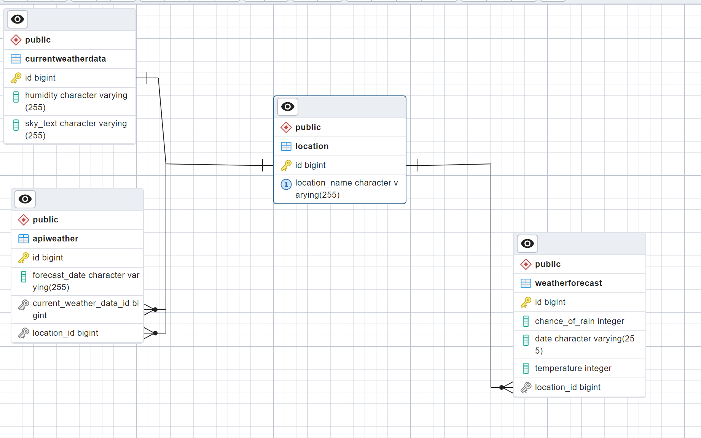

# Documentation - Web Scraping Weather Project

## Introduction
Vores projekt omhandler webscraping, specifikt webscraping af vejrdata på hjemmesiden: https://weather.com/da-DK/weather/tenday/l/0f6aae8ce85a3260606af04be65d1465950d18e7003a8ae18d7282ac31e68bb0.

For at indsamle data til vores Data Transfer Object, kom vi ud for den komplikation, at vi skulle scrape data fra en webside som var delvist lavet i JavaScript og HTML. Dele at informationerne på siden er lavet i HTML samt andre i JavaScript. JSoup kan ikke indhente data fra JavaScript, derfor blev vi nødt til kun at indhente data, som fremgik i HTML koden.

Derfor skrev vi vores DTO klasse om, for at gøre brug af den data som kom fra HTML, i stedet for det som blev indlæst ved brug af JavaScript.

## Edge Cases and Error Handling

### API
Vi benytter os af en API til at berige vores data, som vi scraper fra vores valgte hjemmeside. Et muligt edge case som kan opstå er f.eks. hvis API’en midlertidigt er nede eller en dag bliver fjernet helt. Dette ville give os komplikationer da vi ikke længere kan lave instanser af vores ApiWeatherDTO, til at hente nødvendige data for at oprette entiteter f.eks. currentWeatherData som også bliver brugt i weatherDTOen.

For at håndtere en edge case, burde vi opbygge strukturen på logikken således at brugeren er informeret så snart der er problemer med at kommunikere eller indhente data fra API’en. Samtidigt at den selv prøver at genskabe forbindelsen på et senere tidspunkt, hvis API’en bliver funktionel igen efter et evt. udfald.

Vi kan også udsættes for at API’en bliver ændret, og den data vi modtager fra en ekstern kilde ikke passer med vores integration af det. Det ville skabe problemer, hvis der bliver tilføjet andre parametre eller andre enheder end det vi har indstillet programmet til. Det vil skabe udfordring, da vi ikke kan persistere nye data, da vi ikke kan instantiere entiteter, og DTO’er på samme måde.

For at undgå det, må vi validere det data vi modtager hver gang fra ekstern kilde med vores model, og udarbejde nogle catch og exception cases som kan håndtere at vi ikke modtager de korrekte datatyper eller Null Pointer Exceptions. Lokationen vi søger på kan give fejl hvis API’en ikke genkender den, så brugeren skal blive informeret om at det er en lokation som vi lige nu ikke kan vise prognoser for.

### Database
Databasen kan være nede eller vi ikke er i stand til at oprette forbindelse, betyder at vi ikke kan persistere og finde de entiteter som skal bruges/oprettes.

## ERD Diagram

## Mangler:
Implementation af DAO interface.
Test af vores DAO og service/mapper.

## Web Pages Used
- Scraping: [The Weather Channel - Weather.com](https://weather.com/da-DK/weather/tenday/l/3db22edf37b8d9f9697634cdfeb7851a07cbf48f6242e88af15d5aea121fc62e)
- API Documentation: [Vejr.eu API](https://vejr.eu/pages/api-documentation)
- [Vejr.eu](https://vejr.eu/)